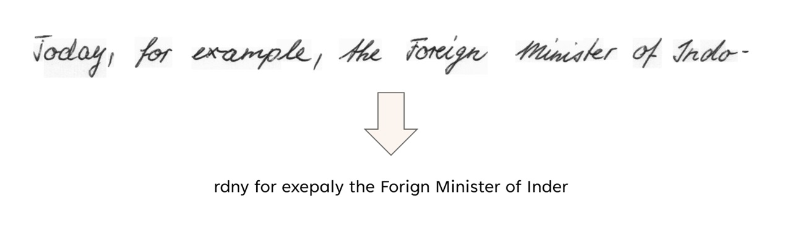

# Handwritten Text Recognition

An attempt at extracting Handwritten Text using Deep Learning. Uses a Convolutional Recurrent Neural Network trained on Handwritten Words. The final solution works along with [CRAFT](https://arxiv.org/abs/1904.01941) to emit Text recognized from an Image.

## Training and Testing

Download the IAM Handwriting Data for Words from [here](https://fki.tic.heia-fr.ch/databases/iam-handwriting-database). Extract the `words.tgz` and `ascii.tgz/words.txt` in a directory named `data`. Run [`src/train.py`](src/train.py) using the Directory Paths. The trained model will be present in the `weights` directory.

Download any Pre-trained Model of [CRAFT](https://github.com/clovaai/CRAFT-pytorch?tab=readme-ov-file#test-instruction-using-pretrained-model) and put in the `weights` directory. Run methods from [`test_model.py`](test_model.py) to test the final model.

> See [`notebook.ipynb`](notebook.ipynb) for reference.

### Example

> This is nowhere near good, I am just trying out things here.
